# BDD Test Coverage - WebSocket Gateway

> **Status**: ✅ 13/13 scenarios PASS
> **Date**: November 16, 2025
> **Epic**: BE-001 WebSocket Gateway
> **Stories**: BE-001.1 (Connection) + BE-001.2 (Presence)

---

## 📊 Test Summary

```
Total Scenarios:  13
Passed:          13 ✅
Failed:           0
Duration:      5.99s
Coverage:      100% (BE-001.1 + BE-001.2)
```

---

## 🗺️ Test Flow Diagram

```mermaid
flowchart TD
    START([BDD Test Suite Start]) --> CONN_START[BE-001.1: Connection Management]

    CONN_START --> S1[Scenario 1: Valid JWT Auth]
    S1 --> S1_STEP1[GIVEN: Valid JWT token]
    S1_STEP1 --> S1_STEP2[WHEN: Connect to WebSocket]
    S1_STEP2 --> S1_STEP3[THEN: Connection accepted]
    S1_STEP3 --> S1_STEP4[AND: Added to connection pool]
    S1_STEP4 --> S1_PASS[✅ PASS]

    S1_PASS --> S2[Scenario 2: Expired JWT Rejection]
    S2 --> S2_STEP1[GIVEN: Expired JWT token]
    S2_STEP1 --> S2_STEP2[WHEN: Attempt connection]
    S2_STEP2 --> S2_STEP3[THEN: Connection rejected]
    S2_STEP3 --> S2_STEP4[AND: Error indicates JWT expired]
    S2_STEP4 --> S2_PASS[✅ PASS]

    S2_PASS --> S3[Scenario 3: Connection Pool Tracking]
    S3 --> S3_STEP1[GIVEN: 3 users with valid tokens]
    S3_STEP1 --> S3_STEP2[WHEN: All connect simultaneously]
    S3_STEP2 --> S3_STEP3[THEN: All 3 accepted]
    S3_STEP3 --> S3_STEP4[AND: Each has unique socketId]
    S3_STEP4 --> S3_STEP5[AND: Pool tracks 3 connections]
    S3_STEP5 --> S3_PASS[✅ PASS]

    S3_PASS --> S4[Scenario 4: Max Connections Enforcement]
    S4 --> S4_STEP1[GIVEN: User with 5 active connections]
    S4_STEP1 --> S4_STEP2[WHEN: Attempts 6th connection]
    S4_STEP2 --> S4_STEP3[THEN: 6th connection rejected]
    S4_STEP3 --> S4_STEP4[AND: First 5 remain active]
    S4_STEP4 --> S4_PASS[✅ PASS]

    S4_PASS --> S5[Scenario 5: Graceful Shutdown]
    S5 --> S5_STEP1[GIVEN: Connected users]
    S5_STEP1 --> S5_STEP2[WHEN: Server sends shutdown signal]
    S5_STEP2 --> S5_STEP3[THEN: Users receive SERVER_SHUTDOWN]
    S5_STEP3 --> S5_STEP4[AND: Message contains shutdown info]
    S5_STEP4 --> S5_PASS[✅ PASS]

    S5_PASS --> S6[Scenario 6: Ping/Pong Heartbeat]
    S6 --> S6_STEP1[GIVEN: Connected client]
    S6_STEP1 --> S6_STEP2[WHEN: Wait for ping interval]
    S6_STEP2 --> S6_STEP3[THEN: Socket.IO handles automatically]
    S6_STEP3 --> S6_STEP4[AND: Connection remains stable]
    S6_STEP4 --> S6_PASS[✅ PASS]

    S6_PASS --> PRES_START[BE-001.2: Presence Tracking]

    PRES_START --> S7[Scenario 7: Join as Editor]
    S7 --> S7_STEP1[GIVEN: Connected user 'editor-001']
    S7_STEP1 --> S7_STEP2[WHEN: Join resource as editor]
    S7_STEP2 --> S7_STEP3[THEN: Receive RESOURCE_JOINED success=true]
    S7_STEP3 --> S7_STEP4[AND: Users list contains editor-001]
    S7_STEP4 --> S7_STEP5[AND: User in Socket.IO room]
    S7_STEP5 --> S7_PASS[✅ PASS]

    S7_PASS --> S8[Scenario 8: Join as Viewer]
    S8 --> S8_STEP1[GIVEN: Connected user 'viewer-001']
    S8_STEP1 --> S8_STEP2[WHEN: Join resource as viewer]
    S8_STEP2 --> S8_STEP3[THEN: Receive RESOURCE_JOINED mode=viewer]
    S8_STEP3 --> S8_PASS[✅ PASS]

    S8_PASS --> S9[Scenario 9: Duplicate Join Rejection]
    S9 --> S9_STEP1[GIVEN: User already joined resource]
    S9_STEP1 --> S9_STEP2[WHEN: Attempt to join again]
    S9_STEP2 --> S9_STEP3[THEN: Receive success=false]
    S9_STEP3 --> S9_STEP4[AND: Error message 'already joined']
    S9_STEP4 --> S9_PASS[✅ PASS]

    S9_PASS --> S10[Scenario 10: Multi-User Broadcast]
    S10 --> S10_STEP1[GIVEN: User A in resource]
    S10_STEP1 --> S10_STEP2[AND: User A listening for USER_JOINED]
    S10_STEP2 --> S10_STEP3[WHEN: User B joins same resource]
    S10_STEP3 --> S10_STEP4[THEN: User A receives USER_JOINED notification]
    S10_STEP4 --> S10_STEP5[AND: Notification contains User B details]
    S10_STEP5 --> S10_PASS[✅ PASS]

    S10_PASS --> S11[Scenario 11: Leave Gracefully]
    S11 --> S11_STEP1[GIVEN: Two users in resource]
    S11_STEP1 --> S11_STEP2[AND: User B listening for USER_LEFT]
    S11_STEP2 --> S11_STEP3[WHEN: User A leaves resource]
    S11_STEP3 --> S11_STEP4[THEN: User B receives USER_LEFT notification]
    S11_STEP4 --> S11_STEP5[AND: Notification contains User A details]
    S11_STEP5 --> S11_PASS[✅ PASS]

    S11_PASS --> S12[Scenario 12: Leave Without Join]
    S12 --> S12_STEP1[GIVEN: User not joined any resource]
    S12_STEP1 --> S12_STEP2[WHEN: Attempt to leave resource]
    S12_STEP2 --> S12_STEP3[THEN: Receive success=false]
    S12_STEP3 --> S12_STEP4[AND: Error message 'not in this resource']
    S12_STEP4 --> S12_PASS[✅ PASS]

    S12_PASS --> S13[Scenario 13: Disconnect Cleanup]
    S13 --> S13_STEP1[GIVEN: User in 2 resources with watcher]
    S13_STEP1 --> S13_STEP2[AND: Watcher listening USER_LEFT]
    S13_STEP2 --> S13_STEP3[WHEN: User disconnects abruptly]
    S13_STEP3 --> S13_STEP4[THEN: Watcher receives 2 USER_LEFT]
    S13_STEP4 --> S13_STEP5[AND: Both have reason='disconnect']
    S13_STEP5 --> S13_STEP6[AND: User removed from all resources]
    S13_STEP6 --> S13_PASS[✅ PASS]

    S13_PASS --> END([✅ All 13 Scenarios PASS])

    style START fill:#4caf50,color:#fff
    style END fill:#4caf50,color:#fff
    style CONN_START fill:#2196f3,color:#fff
    style PRES_START fill:#2196f3,color:#fff

    style S1_PASS fill:#4caf50,color:#fff
    style S2_PASS fill:#4caf50,color:#fff
    style S3_PASS fill:#4caf50,color:#fff
    style S4_PASS fill:#4caf50,color:#fff
    style S5_PASS fill:#4caf50,color:#fff
    style S6_PASS fill:#4caf50,color:#fff
    style S7_PASS fill:#4caf50,color:#fff
    style S8_PASS fill:#4caf50,color:#fff
    style S9_PASS fill:#4caf50,color:#fff
    style S10_PASS fill:#4caf50,color:#fff
    style S11_PASS fill:#4caf50,color:#fff
    style S12_PASS fill:#4caf50,color:#fff
    style S13_PASS fill:#4caf50,color:#fff
```



---

## 🔍 Detailed Scenario Breakdown

### BE-001.1: Connection Management (6 scenarios)

#### ✅ Scenario 1: Valid JWT Authentication

```gherkin
Feature: WebSocket Connection with JWT Authentication
  Scenario: Valid JWT token authentication
    GIVEN a valid JWT token for user "test-user-001"
    WHEN user connects to WebSocket with valid token
    THEN connection should be established successfully
    AND client should be added to connection pool
```

**Test Result**: ✅ PASS
**Duration**: ~200ms
**Socket.IO Transport**: websocket
**JWT Validation**: Middleware checks signature, expiration, issuer, audience

---

#### ✅ Scenario 2: Expired JWT Rejection

```gherkin
  Scenario: Expired JWT token rejection
    GIVEN an expired JWT token for user "expired-user"
    WHEN user attempts to connect with expired token
    THEN connection should be rejected
    AND error should indicate JWT expiration
```

**Test Result**: ✅ PASS
**Duration**: ~150ms
**Error Received**: `JWT_INVALID: JWT validation failed: jwt expired`
**Socket.IO Event**: `connect_error`

---

#### ✅ Scenario 3: Connection Pool Tracking

```gherkin
  Scenario: Connection pool tracking with multiple users
    GIVEN three users with valid tokens
    WHEN all three users connect simultaneously
    THEN all three connections should be accepted
    AND each should have unique socketId
    AND connection pool should track 3 active connections
```

**Test Result**: ✅ PASS
**Duration**: ~300ms
**Verified**: 3 unique socket IDs, all tracked in gateway logs

---

#### ✅ Scenario 4: Max Connections Enforcement

```gherkin
  Scenario: Max connections per user enforcement (limit: 5)
    GIVEN a user with 5 active connections
    WHEN user attempts to open 6th connection
    THEN 6th connection should be rejected
    AND first 5 connections should remain active
```

**Test Result**: ✅ PASS
**Duration**: ~500ms
**Max Connections**: 5 per user (configurable via `WEBSOCKET_MAX_CONNECTIONS_PER_USER`)
**Rejection Method**: Silent disconnect (client receives `disconnect` event)

---

#### ✅ Scenario 5: Graceful Shutdown Notification

```gherkin
  Scenario: Graceful shutdown with notification
    GIVEN multiple connected users
    WHEN server initiates graceful shutdown
    THEN all users should receive SERVER_SHUTDOWN event
    AND event should contain shutdown message
```

**Test Result**: ✅ PASS
**Duration**: ~200ms
**Event**: `SERVER_SHUTDOWN`
**Payload**: `{ message: "Server is shutting down. Please reconnect.", timestamp: "..." }`

---

#### ✅ Scenario 6: Ping/Pong Heartbeat

```gherkin
  Scenario: Ping/pong heartbeat mechanism
    GIVEN a connected client
    WHEN sufficient time passes for ping interval
    THEN Socket.IO should automatically handle ping/pong
    AND connection should remain stable
```

**Test Result**: ✅ PASS
**Duration**: ~100ms
**Ping Interval**: 25000ms (25 seconds)
**Ping Timeout**: 20000ms (20 seconds)
**Implementation**: Socket.IO engine automatic (no custom code needed)

---

### BE-001.2: Presence Tracking (7 scenarios)

#### ✅ Scenario 7: Join Resource as Editor

```gherkin
Feature: Real-time Presence Tracking
  Scenario: Join resource as editor
    GIVEN a connected user "editor-001"
    WHEN user joins resource "resource:page:/patient/BDD-001" as editor
    THEN should receive RESOURCE_JOINED event with success=true
    AND users list should contain editor-001
    AND user should be in Socket.IO room
```

**Test Result**: ✅ PASS
**Duration**: ~200ms
**Event**: `resource:joined`
**Payload**: `{ success: true, users: [...], joinedAt: "...", mode: "editor" }`

---

#### ✅ Scenario 8: Join Resource as Viewer

```gherkin
  Scenario: Join resource as viewer
    GIVEN a connected user "viewer-001"
    WHEN user joins resource as viewer
    THEN should receive RESOURCE_JOINED with mode="viewer"
```

**Test Result**: ✅ PASS
**Duration**: ~150ms
**Mode**: `viewer` (read-only)

---

#### ✅ Scenario 9: Duplicate Join Rejection

```gherkin
  Scenario: Duplicate join attempt rejection
    GIVEN user "duplicate-001" already joined resource
    WHEN user attempts to join same resource again
    THEN should receive RESOURCE_JOINED with success=false
    AND error message should indicate already joined
```

**Test Result**: ✅ PASS
**Duration**: ~200ms
**Error Message**: `"You have already joined this resource."`

---

#### ✅ Scenario 10: Multi-User Broadcast on USER_JOINED

```gherkin
  Scenario: Multi-user broadcast on USER_JOINED
    GIVEN user A is in resource "resource:page:/patient/BDD-004"
    AND user A is listening for USER_JOINED events
    WHEN user B joins the same resource
    THEN user A should receive USER_JOINED notification
    AND notification should contain user B details
```

**Test Result**: ✅ PASS
**Duration**: ~300ms
**Event**: `user:joined`
**Broadcast**: All users in room except joiner
**Payload**: `{ userId, username, email, socketId, joinedAt, mode }`

---

#### ✅ Scenario 11: Leave Resource with Broadcast

```gherkin
  Scenario: Leave resource gracefully with broadcast
    GIVEN two users in resource "resource:page:/patient/BDD-005"
    AND user B is listening for USER_LEFT events
    WHEN user A leaves the resource
    THEN user B should receive USER_LEFT notification
    AND notification should contain user A details
```

**Test Result**: ✅ PASS
**Duration**: ~250ms
**Event**: `user:left`
**Broadcast**: All remaining users in room
**Payload**: `{ userId, username, email, reason: "explicit" }`

---

#### ✅ Scenario 12: Leave Without Join (Error Case)

```gherkin
  Scenario: Leave resource without joining (error case)
    GIVEN a connected user who has not joined any resource
    WHEN user attempts to leave resource
    THEN should receive RESOURCE_LEFT with success=false
    AND error message should indicate not in resource
```

**Test Result**: ✅ PASS
**Duration**: ~150ms
**Error Message**: `"You are not in this resource. Cannot leave."`

---

#### ✅ Scenario 13: Disconnect Cleanup

```gherkin
  Scenario: Disconnect cleanup removes user from all resources
    GIVEN user in multiple resources with watcher
    AND watcher is listening for USER_LEFT events
    WHEN multi-resource user disconnects abruptly
    THEN watcher should receive 2 USER_LEFT notifications
    AND both notifications should have reason="disconnect"
    AND user should be removed from all resources
```

**Test Result**: ✅ PASS
**Duration**: ~400ms
**Cleanup**: Automatic via `handleDisconnect()` lifecycle hook
**Broadcast**: `user:left` with `reason: "disconnect"` to all affected rooms

---

## 🎯 Coverage Mapping to EPIC-001

| Epic Story                         | Scenarios | Status     | Files                        |
| ---------------------------------- | --------- | ---------- | ---------------------------- |
| **BE-001.1** Connection Management | 6         | ✅ 100%    | `be001-1-connection.test.js` |
| **BE-001.2** Presence Tracking     | 7         | ✅ 100%    | `be001-2-presence.test.js`   |
| **BE-001.3** Distributed Locks     | 0         | ⏳ Planned | -                            |
| **BE-001.4** Y.js CRDT Sync        | 0         | ⏳ Planned | -                            |
| **BE-001.5** RabbitMQ Broadcasting | 0         | ⏳ Planned | -                            |
| **BE-001.6** Audit Trail           | 0         | ⏳ Planned | -                            |

**Total Epic Progress**: **33%** (2/6 stories complete)

---

## 🧪 How to Run Tests

```bash
# Run all BDD tests
npm run test:bdd

# Run specific test suite
npm run test:bdd:connection
npm run test:bdd:presence

# Watch mode (not implemented yet)
# npm run test:bdd:watch
```

**Expected Output**:

```
📊 BDD Test Summary
━━━━━━━━━━━━━━━━━━━━━━━━━━━━━━━━━━━━━━━━━━━━━━━━━━━━━━━━━━━━━━━━━━━━━━━━━━━━━━━━
Total:    2 test file(s)
Passed:   2 ✅
Failed:   0
Duration: 5.99s
Time:     2025-11-16T20:09:48.952Z
━━━━━━━━━━━━━━━━━━━━━━━━━━━━━━━━━━━━━━━━━━━━━━━━━━━━━━━━━━━━━━━━━━━━━━━━━━━━━━━━
```

---

## 📂 Test Files Structure

```
scripts/bdd-tests/
├── test-runner.js              # Orchestrator (discovers and runs tests)
├── scenario-executor.js        # Gherkin-style DSL (given/when/then/and)
├── be001-1-connection.test.js  # 6 connection scenarios
└── be001-2-presence.test.js    # 7 presence scenarios
```

---

## 🔗 Related Documentation

- **EPIC Definition**: `/docs/project/EPIC-001-websocket-gateway.md`
- **UI Team Guide**: `/docs/UI_TEAM_WEBSOCKET_API.md`
- **Project Architecture**: `/docs/PROJECT.md` Section 3
- **Gateway Implementation**: `/src/websocket-gateway/`

---

**Last Updated**: November 16, 2025
**Next Milestone**: BE-001.3 Distributed Locks (Week 3-4)
