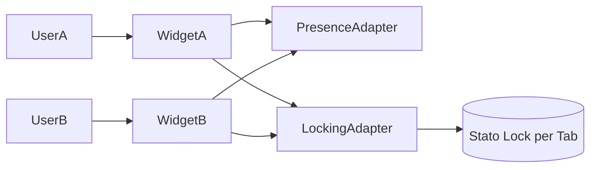
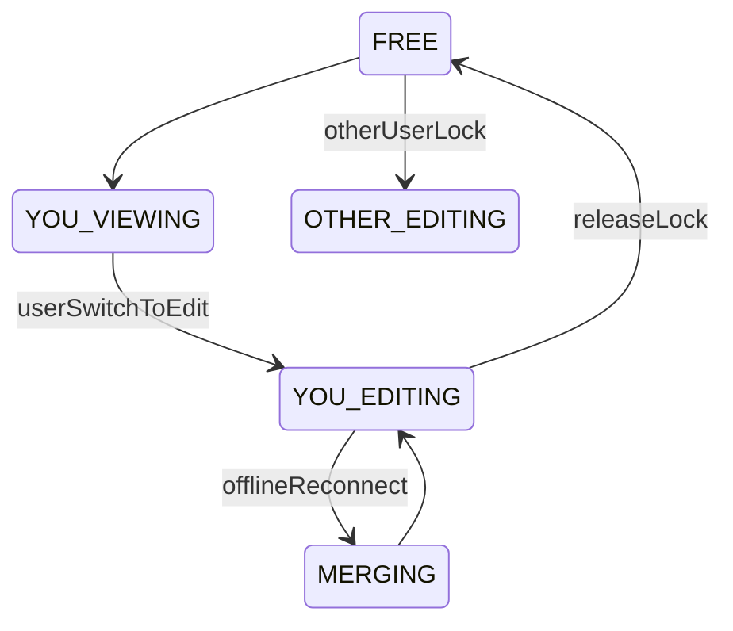
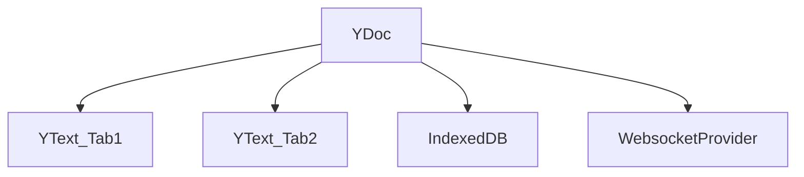

# Diagrammi

## 1. Presence + Locking Overview

```mermaid
flowchart LR
    UserA --> WidgetA
    UserB --> WidgetB

    WidgetA --> PresenceAdapter
    WidgetB --> PresenceAdapter

    WidgetA --> LockingAdapter
    WidgetB --> LockingAdapter

    LockingAdapter --> LockState[(Stato Lock per Tab)]
```

## 2. State Machine del Tab

```mermaid
stateDiagram-v2
    FREE --> YOU_VIEWING
    YOU_VIEWING --> YOU_EDITING : userSwitchToEdit
    FREE --> OTHER_EDITING : otherUserLock
    YOU_EDITING --> MERGING : offlineReconnect
    MERGING --> YOU_EDITING
    YOU_EDITING --> FREE : releaseLock
```

## 3. Struttura Y.js

```mermaid
flowchart TD
    YDoc --> YText_Tab1
    YDoc --> YText_Tab2
    YDoc --> IndexedDB
    YDoc --> WebsocketProvider
```
